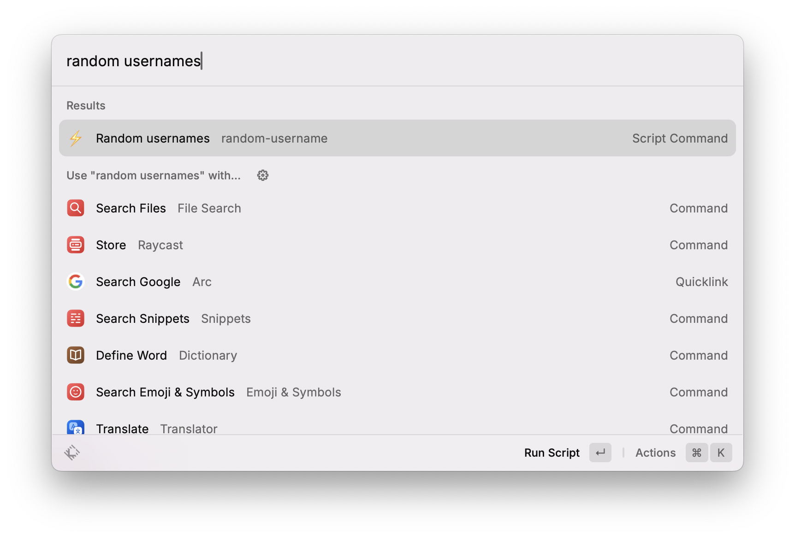
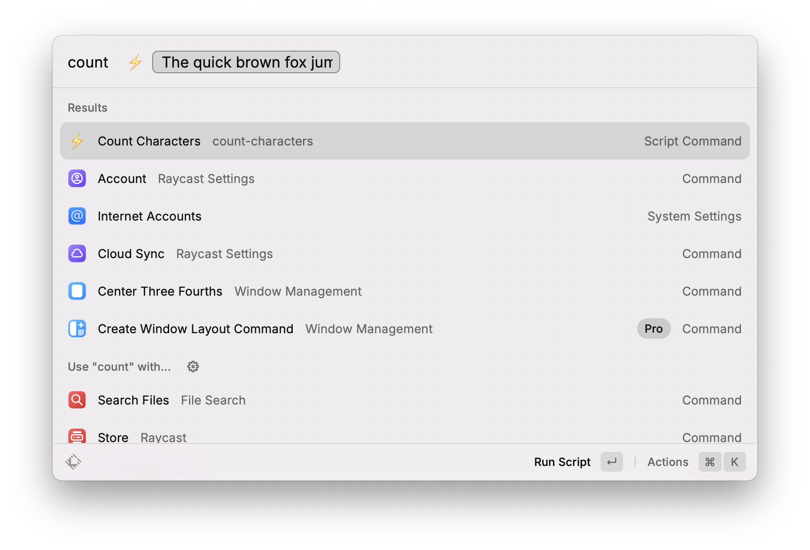
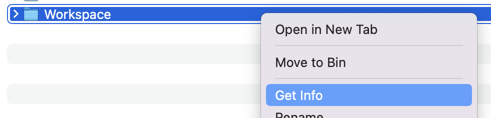
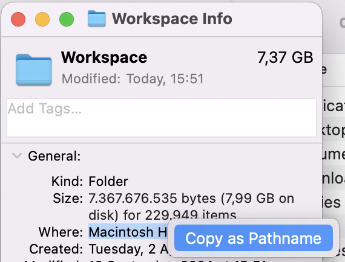
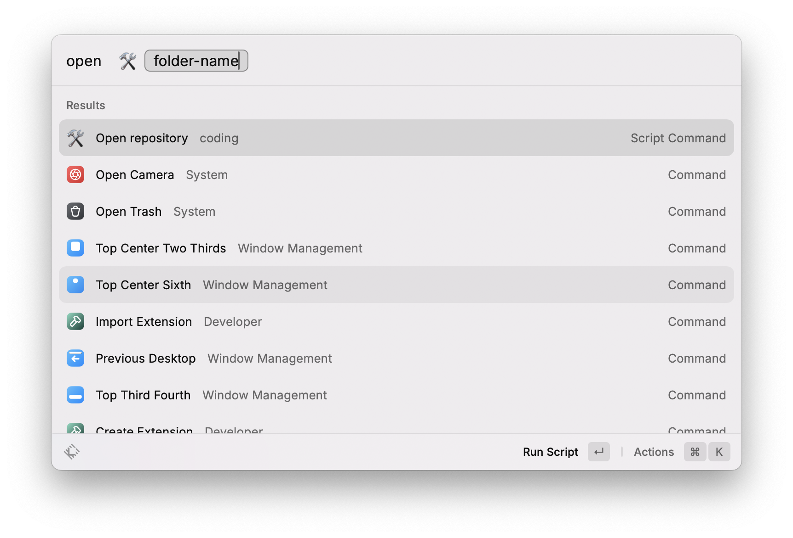

# Raycast Goodies
Raycast snippets + goodies by @dfosco

### Simple Commands

#### Random Usernames

#### Count Characters

---

#### Advanced Commands

> [!WARNING]  
> Before you can use these two commands, replace the contents of `_repositories-folder.txt` with the path of your repository folder

<detail>

Instructions to get repository folder path

The output given will not include the actual folder name, so make sure to add it. In this case:

/Users/dfosco/Workspace
</detail>

### Open Repo

Quickly open any local repositories

### Commit Now

Quickly commit all files in a repository with commit message "Update `repo` @ `date - time`"