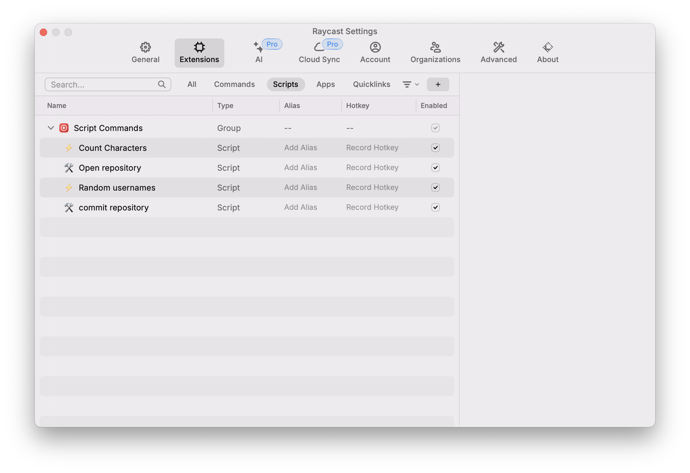
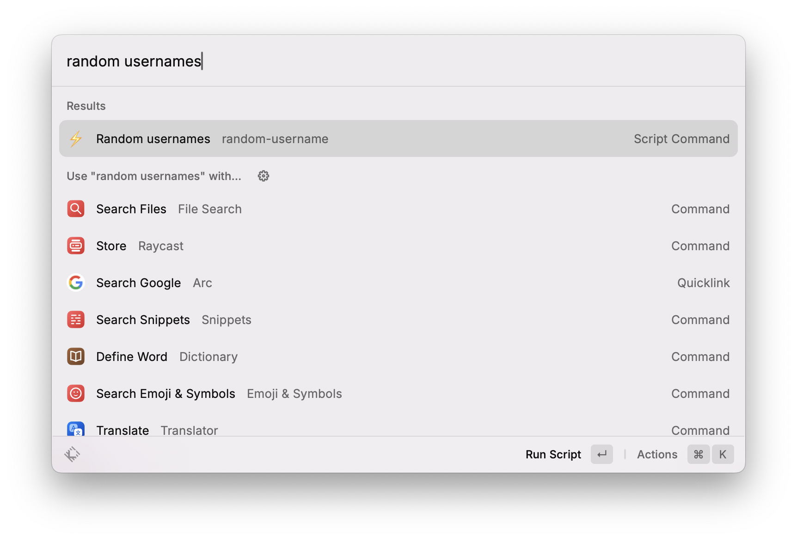
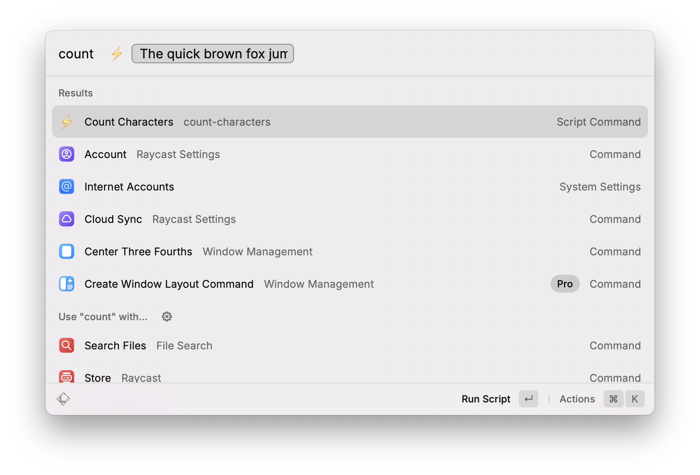
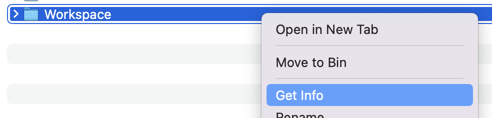
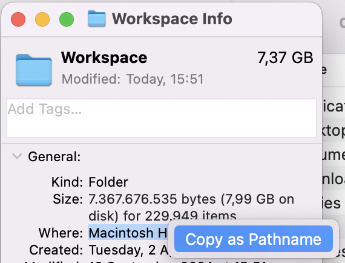
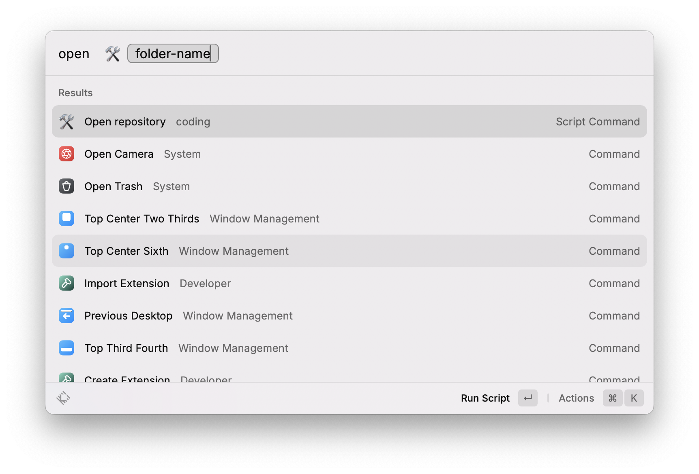
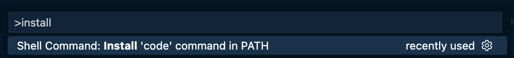
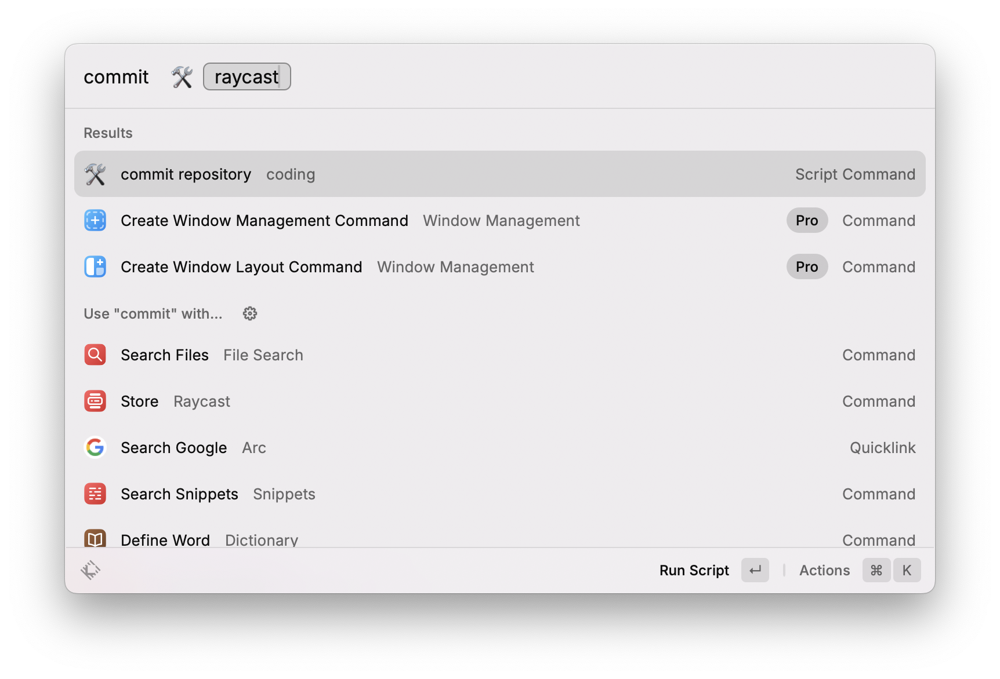
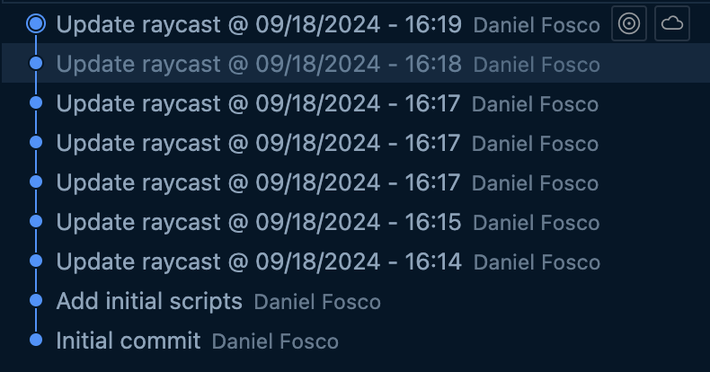

# Raycast Goodies

Raycast snippets + goodies by @dfosco

For a basic overview, check [this discussion](https://github.com/github/growth-life-cycle/discussions/209) with a basic guide for Raycast (GH-staff only)

## Initial Setup

Clone this repository locally and add its folder as your Script Directory on Raycast settings:


The scripts in this folder should appear in the list:


## Simple Commands

### Random Usernames

Add a random username to your clipboard from a list of 100 names. 

> [!TIP]  
> This list was created randomly with an LLM to be a somewhat accurate representation of GitHub usernames — might accidentally contain real people names, **don't use for designs that show up in production**!




### Count Characters

For when you need to know if a text fits in your design... if you know you know.




## Advanced Commands

> [!WARNING]  
> Before you can use these two commands, replace the contents of `_repositories-folder.txt` with the path of the folder where you keep repositories in your Mac

<details>
<summary>Instructions to get repository folder path</summary>





The output copied to your clipboard will not include the actual folder name, so make sure to add it. 

In this case, the output was `/Users/dfosco` and I added `/Workspace` so the file contains a single line with:

```
/Users/dfosco/Workspace
```
</details>

### Open Repo in VS Code

Quickly open any local repository in VS Code, just type its folder name.



> [!TIP]  
> You should have the VS `code` CLI command installed for this. To do so: 
> 1. Open VS Code
> 2. Press `cmd + shift + p`
> 3. Search for “code command” and choose the option below:
> 

### Commit Now

Quickly commit and push all files in a repository with commit message "Update `repo` @ `date - time`"



